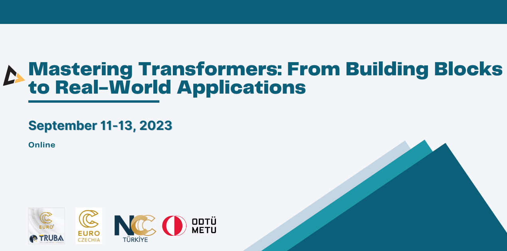

## Table of Contents
1. [Description](#description)
2. [Information](#information)
3. [Certificates](#certificates)

## Description

For the past five years, the amount of transformer-based architectures has grown significantly and keeps dominating the deep learning domain nowadays. They can be considered another leap innovation that pushes the boundaries in deep neural network performance and scalability further. They have been demonstrated with the largest models using over half a trillion parameters and scaled up to thousands of GPUs.

In this course, participants learn the building blocks of transformer architectures in order to apply them to their own projects. These novel methods will be differentiated against existing methods, showing their advantages and disadvantages. Different hands-on exercises give the participants room to explore how the transformers work in different fields of application.

## Information

The overall goals of this course were the following:

Day 1:
- Introduction to Transformers - (Lead trainer: Georg Zitzlsberger):
  - Introduction and history 
  - DNN building blocks 
  - Advantages of Transformers 
  - Hands-On with PyTorch 
  - Machine Learning Lifecycle 
  - Q&A

Day 2:
- Transformers for Natural Language Processing (NLP) (Lead trainer: Tuğba Taşkaya Temizel):
  - Architectures, self-supervising tasks 
  - Introduction to language models 
  - NLP Applications 
  - Hands-On
  - Q&A

Day 3:
- Transformers in action and their applications in other domains (Lead trainer: Alptekin Temizel):
  - Transformers in other domains 
  - Deployment 
  - Optimizations 
  - Multi-GPU/-node with PyTorch DDP 
  - Q&A

All necessary information, links and content for the course can be found on the [course website](https://indico.truba.gov.tr/event/133/).

## Certificates

The certificate for the workshop can be found bellow:

- ["Mastering Transformers: From Building Blocks to Real-World Applications" - NCC Türkiye and NCC Czech Republic]() (Issued On: September 2023)
